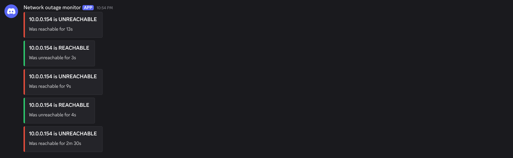

# Network outage monitor

Small script to monitor network outage from LAN to WAN. Used as documentation to send to my ISP.

## Setup

```sh
git clone --depth=1 https://github.com/fslaktern/network-outage-monitor.git
cd network-outage-monitor
```

> [!NOTE]
> You may run the program without root by giving the python executable permission to open raw sockets.
>
> ``` sh
> # Copy the python executable to keep global environment clean
> cp --dereference $(which python3) ./python3-cap-net-raw
>
> sudo setcap cap_net_raw+ep ./python3-cap-net-raw
> ```

## Usage

### Start ping

``` sh
sudo uv run network_outage_monitor daemon --ip 1.1.1.1 --save cloudflare --interval 2
# Starting uptime monitor every 2s. Saving to directory: cloudflare

# Send updates to a Discord channel
sudo uv run network_outage_monitor daemon --ip 1.1.1.1 --save cloudflare --interval 2 --discord-webhook https://discordapp.com/api/webhooks/.../...
# Starting uptime monitor every 2s. Saving to directory: cloudflare
# Resuming from last entry at 2025-10-07 22:47:20 (UP)

# Domains also work, but is less reliable in case of DNS errors
uv run network_outage_monitor daemon --interval 5 --save ./google --ip google.com --discord-webhook https://discordapp.com/api/webhooks/<channel_id>/<secret>
# Starting uptime monitor every 5s. Saving to directory: google

# Data is bitpacked, and entries are only stored when uptime state is changed
# 12 entries * 4 bytes (31 bits + 1 bit) per entry = 48 bytes
ls -lAh cloudflare
# -rw-r--r-- 1 root root 48 Oct  7 22:57 uptime_2025-10.log
```



### Get report

``` sh
uv run network_outage_monitor log --load cloudflare/
# Total uptime: 8m 34s
# Total downtime: 1m 16s
# 
# | Time                | Status |
# |---------------------|--------|
# | 2025-10-07 22:47:20 | UP     |
# | 2025-10-07 22:51:59 | DOWN   |
# | 2025-10-07 22:52:35 | UP     |
# | 2025-10-07 22:52:46 | DOWN   |
# | 2025-10-07 22:52:54 | UP     |
# | 2025-10-07 22:53:46 | DOWN   |
# | 2025-10-07 22:54:11 | UP     |
# | 2025-10-07 22:54:24 | DOWN   |
# | 2025-10-07 22:54:27 | UP     |
# | 2025-10-07 22:54:36 | DOWN   |
# | 2025-10-07 22:54:40 | UP     |
# | 2025-10-07 22:57:10 | DOWN   |
```
